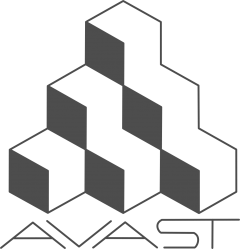
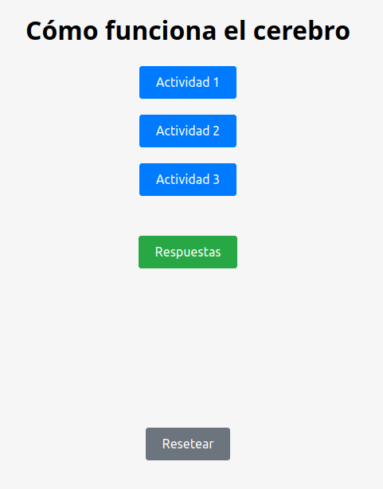

# Cómo funciona el cerebro

<!-- .element style="text-align:center" -->

 <!-- .element style="margin-left: auto; margin-right: auto; display: block" -->

--

# Web de actividades

URL de deployment

 <!-- .element style="margin-left: auto; margin-right: auto; display: block" -->

--

# Actividad 1

- Se mostrarán dos preguntas consecutivas
- Tienes que contestar a ambas preguntas
- No va a mostrar el resultado

--

# Actividad 2

- Aparecerán dos ruletas
- El objetivo es conseguir el mayor número de puntos
- Puedes lanzar sólo una a la vez

--

# Actividad 3

- Hay una regla acerca de tres números
- Tu objetivo es averiguar la regla
- La aplicación te dice si los números cumplen o no la regla

--

Esta página está en blanco intencionadamente

--

Esta página está en blanco intencionadamente

--

# Predicción Actividad 1

Había dos posibles preguntas:
1) ¿Cuánto es la mitad de 50.000.000
2) ¿Cuánto es (5+3)/2-1?

 
 

### Predicción:

En la segunda pregunta, las personas con opción a) han respondido una cantidad mayor que las personas con la opción b)

---

# Explicación Actividad 1

## Sesgo de anclaje

**Es la tendencia a juzgar una situación con base en información recibida recientemente sobre ella**
Este efecto describe la tendencia de las personas a quedarse más con la primera información que se les ofrece

- Anclaje numérico: Nos influencian números arbitrarios a los que estámos expuestos antes de tomar una decisión
- Es más frecuente en decisiones rápidas o de estrés
- Ejemplo: precio en las rebajas
- Ejemplo: entrevistas de trabajo

---

# Predicción Actividad 2

**Habéis girado más la ruleta que estaba toda en verde**
<!-- .element style="text-align:center" -->

---

# Explicación Actividad 2

## Aversión a la pérdida

**Es la tendencia a preferir evitar las pérdidas en lugar de la posibilidad de adquirir ganancias**

La ruleta con números negativos daba un poco más que la de números positivos

Ejemplos:
- Vender una casa por menos de lo que nos ha costado
- Duolingo: vas a perder la racha...
- Modelo fremium

---

# Predicción Actividad 3

**Nadie ha acertado la regla**
<!-- .element style="text-align:center" -->

---

# Explicación Actividad 3

## Sesgo de confirmación

**Es la tendencia a investigar o interpretar información que confirma preconcepciones.**

- Buscamos pruebas que confirmen lo que sabemos
- Habéis puesto más pruebas buscando que de que sí a que de que no

---

# Es sólo la punta del iceberg

Hay muchos más sesgos: https://es.wikipedia.org/wiki/Anexo:Sesgos_cognitivos

- **Efecto Ikea**: Valoramos más aquellos artículos que hacemos nosotros mismos que los que ya vienen hechos
- **Efecto Dunning-Kruger**: Tendencia de los individuos incompetentes a sobreestimar su propia habilidad, y de los individuos altamente competentes a sobreestimar la habilidad de otros individuos.
- **Sesgo retrospectivo o sesgo a posteriori**: Inclinación a ver los eventos pretéritos como predecibles.
- **Error de atribución**: Tendencia de atribuir las causas de la conducta de otras personas a su carácter moral y no a factores situacionales
- **Sesgo de autoservicio**: Tendencia a reclamar más responsabilidad para los éxitos que por los fallos.
- **Sesgo de falso consenso**: Tendencia a creer que las propias opiniones, creencias, valores y hábitos están más extendidos entre el resto de la población de lo que realmente lo están.
- ...

---

# Conclusión

- Somos unos inútiles
- Si el coche se va hacia la derecha, corrige poniendo el volante hacia la izquierda
- La ciencia intenta evitar todo esto
